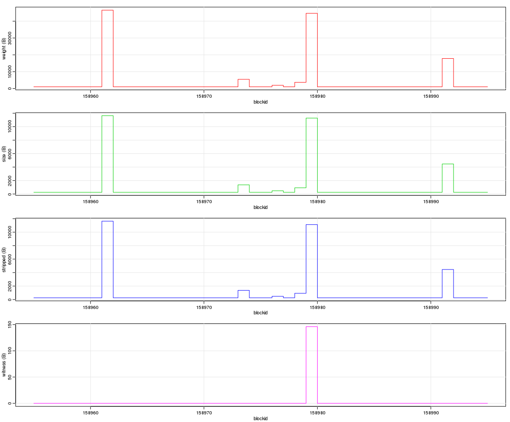
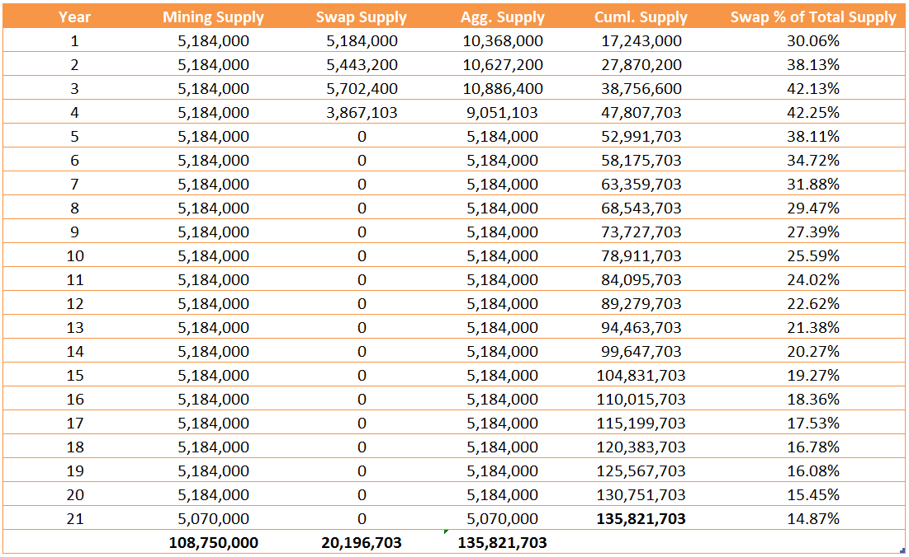
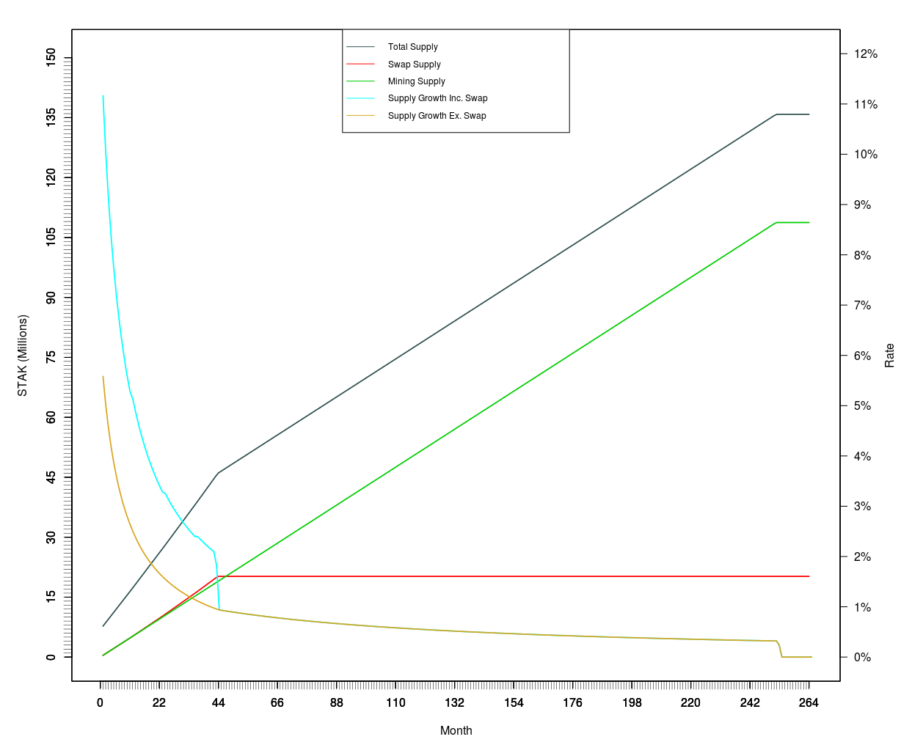

__________________________________________________________________________


#### SegWit and SegWit2x active, Lightning Network compatible, Atomic Swap compatible and an increased non-SegWit block size of 4MB; introducing the first Masternode-enabled digital currency based off core Bitcoin version 0.14.2. STRAKS endeavours to eliminate unwanted transaction malleability through SegWit activation from day 0; solves capacity constraints suffered by Bitcoin and its peer group through a larger non-SegWit block size and increased signature operations - effectively introducing SegWit4x; is Lightning Network compatible - supporting instant payments, scalability, low cost and cross blockchain transactions; proposes a fair distribution through a Zero Start Instamine Protection (ZSIP) policy and Zero Start Masternode Reward (ZSMR) policy; introduces a new unique Masternode payment re-balancing algorithm, labelled Reactive Equilibria (REV1); and furthermore, implements a modified version of the new effective D601 difficulty re-targeting algorithm


__________________________________________________________________________


###### Block Size: 4 MB
###### Max Block Serialized Size: 16 MB
###### Proof-of-Work Algorithm: Lyra2REv2
###### Block Time: 60 seconds
###### Coin Maturity: 100 blocks
###### Transactions Per Second: 133 (Bitcoin: 3, Bitcoin Cash: 27, Dash: 13)
###### Transactions Per 24 hours: 11,520,000
###### Difficulty Retargeting: New D601 Algorithm
###### Maximum Coin Supply: 150 Million
###### Treasury Funding: 5% Per Block
###### SegWit: Active
###### SegWit2x: Active
###### SegWit4x: Active
###### Lightning Network: Compatible
###### Atomic Swaps: Compatible
###### Masternodes: Enabled
###### Masternodes Collateral: 15,000 STAK
###### Masternode Reward: Rebalancing via New Reactive Equilibria (REV1) Algorithm
###### ZSMR: Explicit Masternode Decentralisation Promotion [Zero Reward to Block 50400]
###### ZSIP: Zero Start Instamine Protection [7 Days: 10080 Blocks]


____________________________________________________________________


## Quick Start

- **[STRAKS Website](https://straks.tech)**
- **[STRAKS Explorer](https://straks.info)**

### Community

- **[STRAKS Discord](https://discord.gg/5gzvadZ)**
- **[STRAKS Forum](https://straks.co)**
- **[STRAKS BitcoinTalk](https://bitcointalk.org/index.php?topic=2433318.0)**
- **[STRAKS GitLab](https://lab.straks.co/explore/projects)**
- **[STRAKS GitHub](https://github.com/straks/straks)**
- **[STRAKS Insight](https://straks.tech/insight/)**
- **[STRAKS Telegram](https://telegram.straks.tech)**
- **[STRAKS Twitter](https://twitter.straks.tech)**
- **[STRAKS Facebook](https://facebook.straks.tech)**

### E-commerce, Wallets and Gateways

- **[STRAKS Core Wallet](https://github.com/straks/straks/releases)**
- **[STRAKS Electrum Wallet](https://lab.straks.co/straks/electrum-stak/tags)**
- **[STRAKS Android Wallet](https://github.com/straks/strakswallet-android/releases)**
- **[STRAKS Paper Wallet](https://paper.straks.tech)**
- **[STRAKS Gate](https://lab.straks.co/straks/straksgate)**
- **[STRAKS Gate-ReactJS POS](https://lab.straks.co/straks/react-pos)**
- **[STRAKS Point-of-Sale](https://lab.straks.co/straks/strakspos)**
- **[STRAKS WHMCS-Payment-Gateway](https://lab.straks.co/straks/STRAKS-WHMC-Payment-Gateway)**

### External

- **[CoinMarketCap](https://coinmarketcap.com/currencies/straks/)**
- **[Masternodes Online](https://masternodes.online/currencies/STAK/)**
- **[Masternodes Pro](https://masternodes.pro/stats/stak)**
- **[CoinGecko](https://www.coingecko.com/en/coins/straks)**
- **[Coinlib](https://coinlib.io/coin/STAK/Straks)**
- **[WhatToMine](https://whattomine.com/coins/240-stak-lyra2rev2)**
- **[Crypto-Coinz](https://www.crypto-coinz.net/coin-info/?100-Straks-STAK-Lyra2v2-calculator/)**

### Exchanges/Trading

- **[HitBTC BTC](https://hitbtc.com/exchange/STAK-to-BTC)**
- **[HitBTC ETH](https://hitbtc.com/exchange/STAK-to-ETH)**
- **[CryptoBridge](https://wallet.crypto-bridge.org/market/BRIDGE.STAK_BRIDGE.BTC)**
- **[Stocks.Exchange](https://app.stocks.exchange/en/basic-trade/pair/BTC/STAK/)** 
- **[SouthXchange BTC](https://www.southxchange.com/Market/Book/STAK/BTC)**
- **[SouthXchange USD](https://www.southxchange.com/Market/Book/STAK/USD)**
- **[CREX24 USD](https://crex24.com/exchange/STAK-USD)**
- **[CREX24 BTC](https://crex24.com/exchange/STAK-BTC)**
- **[BarterDex](https://github.com/KomodoPlatform/BarterDEX)**

*For commercial information/proposals please contact: marketing@straks.tech*
*For ALL other enquiries please contact: support@straks.tech*


__________________________________________________________________________


### STRAKS Team

- **Squbs (squbs@straks.tech) - Co-Founder, Development Lead & Strategy**
- **Ekam (ekam@straks.tech) - Co-Founder, Development Lead & Strategy**
- **Michael Reid (michael@straks.tech) - Developer, Marketing & Business Development**
- **Bruno (bruno@straks.tech) - Developer**
- **Jeckziel Ayala (jeckziel@straks.tech) - Developer**
- **Freeman (freeman@straks.tech) - Developer**
- **Andrew (andrew@straks.tech) - Developer**
- **Flydancer (flydancer@straks.tech) - Developer**
- **Daniel Roos (daniel@straks.tech) - Marketing & Business Relations**
- **Anduf Lee (anduflee@straks.tech) - Graphics Designer**
- **Proximus (proximus@straks.tech) - Community Moderator & Public Relations**
- **DalmationCadet (dalmation@straks.tech) - Community Moderator & Public Relations**
- **Atexor (atexor@straks.tech) - Community Moderator & Public Relations**


__________________________________________________________________________


## Introducing STRAKS

Introducing a new decentralised, open source, community driven digital currency, focusing on e-commerce utility.

The name is a Danish word that has never been used in any cryptocurrency context until now. It means quick/immediate - referring to the focus that we have on ensuring that transactions are as fast as can be and to be the most efficient cryptocurrency for e-commerce utility in the sector.

The currency unit of account is **STAK** for its exchange ticker and uses the following unicode characters to indicate STRAKS as digital currency in an abbreviated form in-line with Bitcoin and fiat currencies:
- STAK (U+A7A8) **Ꞩ**
- µSTAK (U+0282) **ʂ**


##### E-Commerce
Global e-commerce sales are projected to reach $2.2 trillion for 2017 and to increase two-fold by 2021 to $4.4 trillion. STRAKS seeks to position itself as a competitive altcoin for e-commerce application. This will be achieved through developing and implementing relevant technology that facilitates e-commerce transactions as smoothly as possible. We will always strive to create partnerships and increase real-world utilisation.


##### Open Source
STRAKS is open source. Anyone is free to contribute to STRAKS’ development and make a pull request through Github. Further details, making community contributions as smooth as possible, will become available in the future on the new website.


##### Decentralized Ownership
Ownership and access rights are decentralized. This ensures that the long-term application and longevity is not dependent on a single individual any longer. This safeguards not only STRAKS' future, but also your investment and partnerships.


##### Community Orientated
One of STRAKS core values is being community oriented. Rest assured knowing that the STRAKS foundation team will always strive to collect feedback and suggestions from the community and evaluate the input.

With the upcoming STRAKS-vote you will be able to not only propose ideas publicly to all STRAKS holders but also vote on what needs developing or prioritising next. Look out for STRAKS-vote on the Roadmap.


##### Speed & Privacy
Speed and privacy are core concerns for users today as well as e-commerce businesses. To ensure that STRAKS is as effective as possible for e-commerce application, STRAKS will maintain a high focus on increasing anonymity and most important on increasing speed of transactions - to always be at the forefront.

__________________________________________________________________________


### STRAKS Comparison with Leading Digital Currencies

There is only **one** digital currency on this list that is designed - from the bottom up - to be scalable, fast, low cost, secure, decentralized and provide for instant utility, and that is **STRAKS**, the alternative conclusion is simply an escalation of commitment. As part of STRAKS' decentralization manifesto, we fully support a diverse crypto-currency sector - with the caveat that we are **strictly against the concentration of hashing power**, through the use of asic hardware.

> Escalation of commitment refers to a pattern of behavior in which an individual or group will continue to rationalize their decisions, actions, and investments when faced with increasingly negative outcomes rather than alter their course.


__________________________________________________________________________


### Specifications

As above summary, in addition, the following notable items:


#### Notes, Knowledge Base & Support

Note: Pending full implementation and roll out of a STRAKS Lightning Network, **all other STRAKS' features are enabled and functional from day 0**; end-users can utilise STRAKS' speed, larger chain capacity, cross-chain atomic swaps, segregated witness and Masternode functionality straight away.

Guides and additional information can be found on the [STRAKS' Knowledge Base](https://straks.co), and direct support can be sought on the [STRAKS Discord](https://discord.gg/5gzvadZ)


#### Zero Start Instamine Protection (ZSIP)

STRAKS blockchain has been set to issue a 0 block subsidy up to **block height 10080**. At 1440 blocks per day, this is approximately 7 days. During this time, community members will be informed of launch and will be able to configure their setups for mining. During this period there are no Treasury payments, either.


#### Maximum Coin Supply and Block Reward

STRAKS will be capped at a maxium supply of **150 million coins**. This target supports a managed inflation rate that allows for a constant block reward of **10 STAKs**.

The constant block reward prevents event cliffs related to expected "halvings" and will support a more consistent and stable participation rate over a long time horizon.

More information will be available on the STRAKS' [website](https://straks.tech)

##### The Monetary Curve Based on a 10 STAK Block Reward


##### The Monetary Curve Underlying Dataset with Zero Start Block Offset


#### POW Algorithm: Lyra2REv2

Fast, power-efficient and asic resistant algorithm. The STRAKS development team will continue to support a decentralized asic resistant blockchain, and will update the POW algorithm if the latter is no longer the case.

Lyra2 is simple tunable password hashing scheme (PHS) based on cryptographic sponges. Designed to be resistant against parallel attacks from mult-core/gpu systems through its sequential processing. More specific information about Lyra2 itself can be obtained from: http://lyra-2.net/

Lyra2RE wrapped the Lyra2 PHS with additional cryptographic hash functions, and Lyra2REv2 is another derivative, again, with Lyra2 at its core. Notably, chaining the hashing algorithms allows for an easy path to fulfil a decentralization ideology and maintain asic resistance.

The difference between Lyra2RE and Lyra2REv2 is as follows;

- Additional 2 rounds of [CubeHash](https://en.wikipedia.org/wiki/CubeHash)
- Additional 1 round of [Blue Midnight Wish](https://www.mathematik.hu-berlin.de/~schliebn/dl/Blue-Midnight-Wish.pdf)
- Removal of [Groestl](http://www.groestl.info/)


#### **NEW** Difficulty Retargeting Algorithm (D601 - Amaury Sechet)

Recent public discussions on how to address Bitcoin Cash's hash rate oscillation has resulted in an excellent approach that addresses many weaknesses of various other algorithms. A well developed analsysis was presented by Bitcoin Cash's developer Amaury Sechet and supported by Zawy12 via thorough analysis, with simulated results that demonstate the algorthim's effectiveness. The proposed implementation was modified specific to STRAKS blockchain.

More information can be found here:

- [Bitcoin Mailing List Discussion](https://lists.linuxfoundation.org/pipermail/bitcoin-ml/2017-August/000136.html)
- [Bitcoin News - Bitcoin Cash Hard Fork](https://news.bitcoin.com/bitcoin-cash-hard-fork-plans-updated-new-difficulty-adjustment-algorithm-chosen/)

##### The Modified D601 Algorithm Targeting a 60 Second Block Time for STRAKS Blockchain


#### Treasury Funding

In order to support continued development, exchange lisiting fees, web/node hosting costs, and various other operational costs related to running a successful blockchain, the STRAKS development team have decided to introduce a 5% treasury fee in perpetuity. We intend to ensure that the new currency is competitive and successful. To be able to deliver on that vision, we need to ensure that the currency is well-funded throughout its lifecycle.

At 5%, approximately 72 blocks per day are mined for treasury (720 STAK). In the spirit
of transparency, the following 2-of-3 multisig addresses are the official
treasury addresses:

```
[0] 3K3bPrW5h7DYEMp2RcXawTCXajcm4ZU9Zh
[1] 33Ssxmn3ehVMgyxgegXhpLGSBpubPjLZQ6
[2] 3HFPNAjesiBY5sSVUmuBFnMEGut69R49ca
[3] 37jLjjfUXQU4bdqVzvpUXyzAqPQSmxyByi

```

#### Masternodes (and ZSMR)

Masternodes will be supported with a collateral requirement of **15,000 STAK**.

The collateral requirement is a dynamic target value and will be updated for future
releases based on the market price of STRAKS and return on investment relative to
its peer group.

Masternode payments do not start until after approximately 5 weeks post launch. More
specifically, after **block height 50400**. This is an active promotion of Masternode
decentralization via the Zero Start Masternode Reward policy. This delayed reward
mechanism seeks to provide sufficient time for swap holders and investors alike to set
up nodes.

Once the exact collateral requirement is accumulated inside an applicable wallet, the
associated configured Masternode can be activated. Note that the node will only start
receiving payments after the aforementioned ZSMR block height.


#### Masternode Payment Rebalancing: **NEW** Reactive Equilibria (REV1)

Unique to STRAKS is the use of a new continuous activation function based algorithm,
labelled Reactive Equilibria (REV1), that seeks to rebalance the payments made
to miners versus Masternodes. There is a hard limit of 60% of the block reward that
can be appropriated for Masternode payments; this limit defines the boundary at which
total supply locked by Masternodes versus total circulation remains below ~13%.
As the Masternode count increases, the payment to Masternode holders will
decline in favour of miners in order to support a decentralised ideology. The
new algorithm is simple in design but highly effective and lays the foundation for
future advancements. More information about this feature will be posted on the
[main site](https://straks.tech).

##### Reactive Equilibria Masternode Payment Rebalancing Profile


#### **NEW** Segregated Witness 2x/4x


SegWit2x is a combination of both SegWit and a 2MB hardfork. STRAKS has further
increased the non-SegWit block size to **4MB** from the outset to allow for greater
scalability and utility. The maximum serialised block size is **16MB** for STRAKS.

STRAKS is both lightning network and atomic swap compatible. And unlike
many other "compatible" altcoins, SegWit, SegWit2x and the larger blocksize are enabled from the outset.

For further information about Segregated Witness please visit [bitcoincore.org](https://bitcoincore.org/en/2016/01/26/segwit-benefits/)

##### Segregated Witness Transaction on STRAKS Mainnet, [block:158979, txid:f729065b24497a99e3152372ef63b96b79228d0b6134e894cb3dcba47d2727f6]


##### Segregated Witness Transaction on STRAKS Testnet, [block:6635, txid:3fc630ac1a4b91714d7c7150275b8be019152329e70d1f7a37240a7331b9fab6]


#### InstantTX and DarkSend Removal
*(Reproduced here for information purposes only, not release related)*

Dropped support for both InstantTX and DarkSend. With the SegWit upgrade these features are going to be superseeded by far superior technology. SegWit will enable the STRAKS to adopt the [Lightning Network](https://lightning.network/lightning-network-paper.pdf), cross-chain atomic swaps, advanced versions of [TumbleBit](https://eprint.iacr.org/2016/575.pdf) and more.


#### Hierarchical Deterministic Key Generation
*(Reproduced here for information purposes only, not release related)*

Newly created wallets will use hierarchical deterministic key generation
according to BIP32 (keypath m/0'/0'/k').
Existing wallets will still use traditional key generation.

Backups of HD wallets, regardless of when they have been created, can
therefore be used to re-generate all possible private keys, even the
ones which haven't already been generated during the time of the backup.
**Attention:** Encrypting the wallet will create a new seed which requires
a new backup!

Wallet dumps (created using the `dumpwallet` RPC) will contain the deterministic
seed. This is expected to allow future versions to import the seed and all
associated funds, but this is not yet implemented.

HD key generation for new wallets can be disabled by `-usehd=0`. Keep in
mind that this flag only has affect on newly created wallets.
You can't disable HD key generation once you have created a HD wallet.

There is no distinction between internal (change) and external keys.

HD wallets are incompatible with older versions of Bitcoin Core.

[Pull request](https://github.com/bitcoin/bitcoin/pull/8035/files), [BIP 32](https://github.com/bitcoin/bips/blob/master/bip-0032.mediawiki)


#### Signature validation using libsecp256k1
*(Reproduced here for information purposes only, not release related)*

ECDSA signatures inside Bitcoin transactions now use validation using
[libsecp256k1](https://github.com/bitcoin-core/secp256k1) instead of OpenSSL.

Depending on the platform, this means a significant speedup for raw signature
validation speed. The advantage is largest on x86_64, where validation is over
five times faster. In practice, this translates to a raw reindexing and new
block validation times that are less than half of what it was before.

Libsecp256k1 has undergone very extensive testing and validation.

A side effect of this change is that libconsensus no longer depends on OpenSSL.


#### Direct headers announcement (BIP 130)
*(Reproduced here for information purposes only, not release related)*

Between compatible peers, [BIP 130](https://github.com/bitcoin/bips/blob/master/bip-0130.mediawiki)
direct headers announcement is used. This means that blocks are advertised by
announcing their headers directly, instead of just announcing the hash. In a
reorganization, all new headers are sent, instead of just the new tip. This
can often prevent an extra roundtrip before the actual block is downloaded.


__________________________________________________________________________


### Signatum Swap and Developers Premine Information

**Please note: You can no longer swap from Signatum to STRAKS. The offer registration period has expired.**

In the spirit of full transparency please read the following information carefully and ask questions on the STRAKS Discord server if you are unsure of anything.

#### No Technical Association with Signatum

This is a new digital currency and it shares no technical association to Signatum other than its superficial placeholder name and proposed “proof-of-burn” style swap mechanics. The STRAKS team extended the Signatum community an offer to swap away from Signatum in the light of the scam perpetrated by the old Signatum developers. The whole team was in agreement that this approach would preserve value for Signatum investors and help promote a clean, trustworthy and community orientated cryptocurrency sector.

Prior to the launch of STRAKS, the Signatum community voted in favour of 4:1 swap to the coin under development (2017-11-04). The process involved instantly burning the Signatum coins that was received in exchange for STRAKS to be paid over a specified period of time, as noted below.


#### The Swap and Developers Funds

Instead of premine, primarily due to the new REV1 payment rebalancing algorithm requiring tracking of supply information, an instamine was added to Block 1 for the total of **41,250,000 STAK**.

The calculation of the swap and developer funds buffer is as follows:

```
Swap Ratio: 4 SIGT : 1 STAK
Signatum Circulation (approx): 137,000,000 SIGT
Assumed Circulation for Swap (0.36% buffer): 137,500,000 SIGT
*(Buffer covers 30 days swap period POS generation)*

STRAKS Swap Allocation: 34,375,000 STAK
STRAKS Swap Allocation (% of Max Supply): 22.9%

STRAKS Developers Allocation: 6,875,000 STAK
STRAKS Developers Allocation (% of Max Supply): 4.6%
```

Coins that remain unswapped of the initial dedicated swap supply: 60% will be dedicated towards the treasury fund and 40% will be used for air-drops (with minor requirements to increase exposure and awareness). Full transparency will be provided and users are encouraged to track primary swap funds address.


```
Swap and Developer Funds Address(es)
------------------------------------
at the time of writing;

Swap
[0.0] SUUTsZhb7cpXNgZbieKFrE8gocAtL7EK1C
[0.1] SPkVa5cB1kcgJk5rinL3p9w47qnjpej5gm
[0.2] SPFTqzvx63YGt6U5GJ2WpbmsatTtZ8gsZr
[0.3] SiUHsUD7BcHBwry2kZbQrm6YS7XkG8BvGG
...
[0.n] See https://straks.info/richlist for updated addresses

Developers
[1.0] SUUTsZhb7cpXNgZbieKFrE8gocAtL7EK1C
[1.1] STnW6H7rFWmoXoriS5zjuqBQntnvD1tvhB
[1.2] SZH7YJvMf4Wfxbf5ioZZgkasthebS9gZ4y
[1.3] ShLgqYKRWrueCtbDXTPL9h64d1Kf73Sv86
...
[1.n] See https://straks.info/richlist for updated addresses


Initial Mint to Swap Address:
----------------------------
Block Hash:

[1] 00000b6321951f2ed170bbc9b7a360995176f2df418b0e275149bfce2fde3d6c

{
  "hash": "00000b6321951f2ed170bbc9b7a360995176f2df418b0e275149bfce2fde3d6c",
  "confirmations": 82,
  "strippedsize": 248,
  "size": 248,
  "weight": 992,
  "height": 1,
  "version": 805306387,
  "versionHex": "30000013",
  "merkleroot": "4f70027abe261ca60e37ede92a988594be405dca13bdcbab915872e79ee5ff46",
  "tx": [
    "4f70027abe261ca60e37ede92a988594be405dca13bdcbab915872e79ee5ff46"
  ],
  "time": 1510792676,
  "mediantime": 1510792676,
  "nonce": 3848,
  "bits": "1e0fffff",
  "difficulty": 0.0002441371325370145,
  "chainwork": "0000000000000000000000000000000000000000000000000000000000200011",
  "previousblockhash": "00000df14d859c4b3219d93978bcf02afc123d2344a2ed39033e1208948aa7c0",
  "nextblockhash": "000001c4bb98a9d3863d26325d95d3ed774309a605c9b0b18746f14e50253a4c"
}

Coinbase Transaction:

{
  "txid": "4f70027abe261ca60e37ede92a988594be405dca13bdcbab915872e79ee5ff46",
  "hash": "4f70027abe261ca60e37ede92a988594be405dca13bdcbab915872e79ee5ff46",
  "size": 167,
  "vsize": 167,
  "version": 2,
  "locktime": 0,
  "vin": [
    {
      "coinbase": "510101",
      "sequence": 4294967295
    }
  ],
  "vout": [
    {
      "value": 41250000.00000000,
      "n": 0,
      "scriptPubKey": {
        "asm": "OP_DUP OP_HASH160 4ec371eeab928ff421d09f9ed54ec1c98098ab50 OP_EQUALVERIFY OP_CHECKSIG",
        "hex": "76a9144ec371eeab928ff421d09f9ed54ec1c98098ab5088ac",
        "reqSigs": 1,
        "type": "pubkeyhash",
        "addresses": [
          "SUUTsZhb7cpXNgZbieKFrE8gocAtL7EK1C"
        ]
      }
    },
    {
      "value": 0.00000000,
      "n": 1,
      "scriptPubKey": {
        "asm": "OP_HASH160 1343c8390c5f73d608f4b47e6959d8f3ae863605 OP_EQUAL",
        "hex": "a9141343c8390c5f73d608f4b47e6959d8f3ae86360587",
        "reqSigs": 1,
        "type": "scripthash",
        "addresses": [
          "33Ssxmn3ehVMgyxgegXhpLGSBpubPjLZQ6"
        ]
      }
    },
    {
      "value": 0.00000000,
      "n": 2,
      "scriptPubKey": {
        "asm": "OP_RETURN aa21a9ede2f61c3f71d1defd3fa999dfa36953755c690689799962b48bebd836974e8cf9",
        "hex": "6a24aa21a9ede2f61c3f71d1defd3fa999dfa36953755c690689799962b48bebd836974e8cf9",
        "type": "nulldata"
      }
    }
  ]
}


Transfer to Developers Address:
-------------------------------
Block:
{
  "hash": "00000091f8b8c6f80eed773988516b66a1f5b1c5f3d4f79b9a04dad2ac2d788c",
  "confirmations": 47,
  "strippedsize": 475,
  "size": 511,
  "weight": 1936,
  "height": 4827,
  "version": 536870912,
  "versionHex": "20000000",
  "merkleroot": "10a1dddf9e7de23eeada61dfa141214f781c7e79d4d128d156df3a0a73ce9eec",
  "tx": [
    "6efb7d32aa752c234f443eb1cd4c1d874f0d701df5f565e20497937ef3735154",
    "244a50f42d5685998ef111435a0047f8fdee5c2cd500f6c14e5cba3a4a773672"
  ],
  "time": 1511115839,
  "mediantime": 1511099961,
  "nonce": 27792,
  "bits": "1e00b2f4",
  "difficulty": 0.005587970264341221,
  "chainwork": "00000000000000000000000000000000000000000000000000000013c1e58d50",
  "previousblockhash": "0000000f269e70087c382256eb88a9e81c5384a2fa2f43e22b03c368923c205f",
  "nextblockhash": "0000007a7ec954fab0e3a42aa2b4a8dbec6bf2afaa8dfadcb7c242899c1ab17e"
}

Transaction:
{
  "account": "0",
  "address": "Sh87ZGfyfQ1XmRKCESgRGVzgUqvqAd72YM",
  "category": "receive",
  "amount": 6875000.00000000,
  "label": "0",
  "vout": 1,
  "confirmations": 33,
  "bcconfirmations": 33,
  "blockhash": "00000091f8b8c6f80eed773988516b66a1f5b1c5f3d4f79b9a04dad2ac2d788c",
  "blockindex": 1,
  "blocktime": 1511115839,
  "txid": "244a50f42d5685998ef111435a0047f8fdee5c2cd500f6c14e5cba3a4a773672",
  "walletconflicts": [
  ],
  "time": 1511100548,
  "timereceived": 1511100548,
  "bip125-replaceable": "no"
}
```

#### The Swap Mechanics

The swap process will be conducted in a manner such that it aligns STRAKS' investor/miner incentives, STRAKS' team long-term objectives, and SIGT's "investors" seeking to accrue value alongside the STRAKS' community.

The distribution of swap funds will be managed to the extent that significant disruption of STAK circulation and market value can/will be minimised. It would be unreasonable to think that the development team have not extensively considered the detrimental impact of an instantaneous increase in the circulation of STAK coins post swap. To this consideration, the process defined, as follows, to an appreciable degree, prevents SIGT investors benefiting at the expense of STRAKS' miners/investors.


##### The Swap Process

Following the end of the swap registration period (**__04 January 2018 18:00 UTC__**), ~28 days post announcement of the start, the **swap payments are distributed on a weekly basis**, in-line with the rate at which supply is being generated for STAK through mining, i.e at 1440 blocks per day = 14,400 STAK per day. With the minor adjustment of the swap supply distribution being accelerated by 5% each year.

All Signatum coins were **burnt instantly** upon receipt in a transparent manner, which the community were able to track via the Signatum explorer. This was aligned with the STRAKS team's position to *NOT* be responsible for the maintenance of Signatum's chain, associated nodes and issues that would have arisen otherwise over the duration of the swap payback period. The STRAKS team is *only* responsible for the swap allocated STAK and weekly distributions to swap participants on an ongoing basis.

```
Monthly total swap distribution for registered STAK swap addresses:

Year 1 per Month: 432,000 STAK distributed; equivalent to 1,728,000 SIGT
Year 2 per Month: 453,600 STAK distributed, equivalent to 1,814,400 SIGT
Year 3 per Month: 475,200 STAK distributed, equivalent to 1,900,800 SIGT
Year 4 for 7 Months: 496,800 STAK distributed, equivalent to 1,987,200 SIGT
Year 4 for 1 Month: 389,503 STAK distributed, equivalent to 1,558,012 SIGT

Total Swap Distribution: 20,196,703 STAK
```

##### Swap Supply Relative to Total Supply (+Mining)



By tracking POW generation, we have essentially **introduced a parallel POS system for SIGT "investors"**. As such, SIGT investors are rewarded in-line with miners without having to "re-mine" coins - having done so already. **We the STRAKS team, presented this as an equitable approach for all parties concerned**.

We note, again however, that Signatum investors/miners were not compelled in any way shape or form to participate in this swap. This was simply an offer with the goal of alleviating their distress from being scammed by Signatum's development team, and to **build trust for the crypto-currency sector**, from an external perspective. Moreover, to promote a **zero tolerance policy for nefarious operators within the sector**.

If you have any questions, or misunderstandings, please ask questions on the [STRAKS Discord](https://discord.gg/5gzvadZ).

##### Total Circulation Versus Swap Supply and Mining Supply (Monthly)



__________________________________________________________________________


### Acknowledgements

Credit goes to Bitcoin Core, Dash and Bitsend for providing a basic platform for
STRAKS to enhance and develop, in concert with a shared desire to support the
adoption of a decentralised digital currency future for the masses.


__________________________________________________________________________


### License

STRAKS Core is released under the terms of the MIT license. See [COPYING](COPYING) for more
information or see https://opensource.org/licenses/MIT.


__________________________________________________________________________


### Development Process

The `master` branch is meant to be stable. Development is normally done in separate branches.
[Tags](https://github.com/straks/straks/tags) are created to indicate new official,
stable release versions of STRAKS' Core.

The contribution workflow is described in [CONTRIBUTING.md](CONTRIBUTING.md).


__________________________________________________________________________


### Building process

**compiling STRAKS from git**

Use the autogen script to prepare the build environment.

    ./autogen.sh
    ./configure
    make

**precompiled binaries**

Precompiled binaries are available at GitHub, see
https://github.com/straks/straks/releases

Always verify the signatures and checksums.


__________________________________________________________________________
